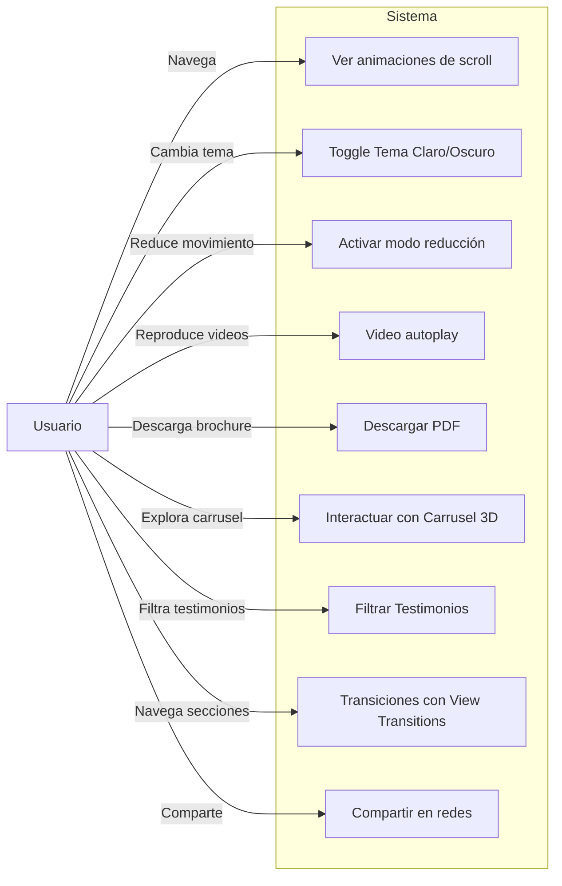
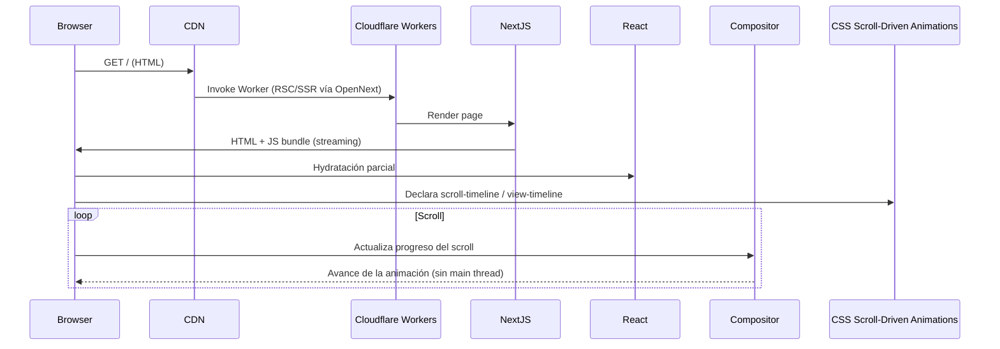
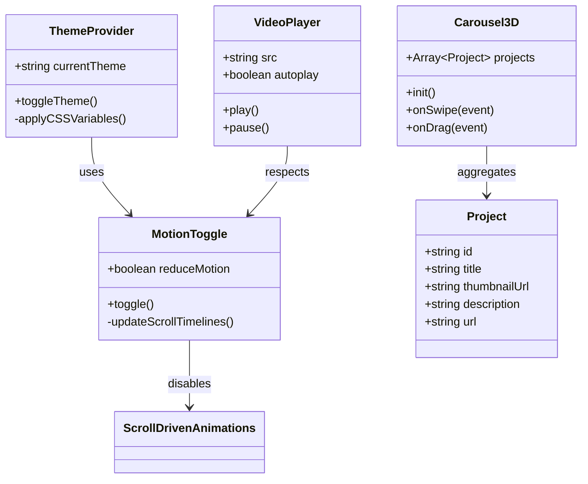
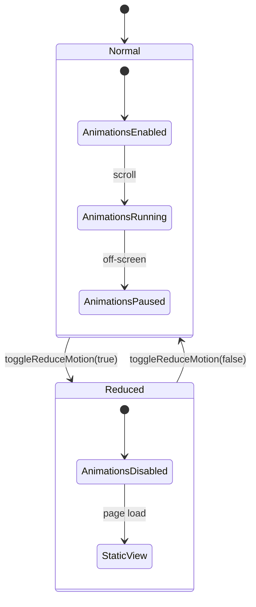
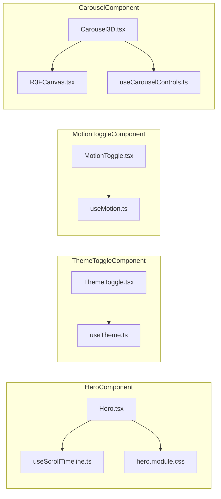

# Documentación del Proyecto

## 1. Objetivo
Crear una página web corporativa para la empresa **TwoFFactor** (Fair and Fast) que, mediante scroll‑down animation, ofrezca la experiencia de usuario más fluida y atractiva disponible en 2026, construida sobre estándares nativos del navegador de última generación (CSS Scroll‑Driven Animations, View Transitions API, WebGPU). El proyecto resuelve la necesidad de presentar el portafolio y los servicios de forma impactante, con interacción instantánea y garantizando accesibilidad WCAG 2.2 AA. Se medirán los resultados mediante **tasa de conversión ≥ 8 %**, **Core Web Vitals en verde (LCP < 2,5 s, INP < 200 ms, CLS < 0,1)** y **Score de Lighthouse ≥ 95**.

---

## 2. Información General

| Ítem                     | Valor                                                                 |
|--------------------------|-----------------------------------------------------------------------|
| **Nombre del proyecto**  | TwoFFactor‑ScrollLanding                                              |
| **Versión**              | 1.0.0                                                                 |
| **Fecha**                | 2026‑09‑29                                                            |
| **Stack tecnológico**    | React 19, Next.js 16 (App Router, RSC + PPR), TypeScript, Tailwind CSS v4, CSS Scroll‑Driven Animations, View Transitions API, GSAP / Motion, WebGPU + React Three Fiber, Cloudflare Workers (OpenNext), R2, Stream, Images, Web Analytics |
| **Perspectivas de expertos** | Ingeniero de Sistemas, Diseñador UX, Animador Web, Especialista en Accesibilidad, Ingeniero de Rendimiento |

---

## 3. Actores Relacionados

| Actor                         | Responsabilidad dentro del sistema                                                                            |
|------------------------------|----------------------------------------------------------------------------------------------------------------|
| **Desarrollador senior**      | Usa la web como vitrina de la empresa, evalúa performance y comparte casos de estudio con clientes potenciales |
| **Estudiante de Ingeniería**  | Navega los casos de estudio, busca oportunidades de empleo y verifica la accesibilidad del sitio               |
| **Ingeniero de Sistemas**     | Define la arquitectura serverless‑edge, gestiona CI/CD y supervisa la disponibilidad global                  |
| **Diseñador UX**              | Define flujos, jerarquías visuales, tokens de diseño y micro‑interacciones                                       |
| **Animador Web**              | Implementa animaciones con CSS Scroll‑Driven Animations, View Transitions API y, como complemento, GSAP / Motion; escaparate 3D con WebGPU / React Three Fiber |
| **Especialista en Accesibilidad** | Garantiza cumplimiento WCAG 2.2 AA, gestiona el toggle de reducción de movimiento (`prefers-reduced-motion`) y contraste ajustable |
| **Ingeniero de Rendimiento**  | Optimiza RSC/streaming/PPR, lazy‑loading, code‑splitting, assets en WebP/AVIF y define métricas de performance (INP, LCP, CLS) |
| **Product Owner**             | Prioriza funcionalidades y valida requisitos de negocio                                                       |
| **Tester de QA**              | Ejecuta pruebas automatizadas de UI, performance y accesibilidad                                               |

---

## 4. Descripción de la Necesidad
En el 2026, los visitantes esperan experiencias web que combinan **interactividad visual** y **rapidez**. Las empresas de desarrollo de software compiten por destacar su portafolio sin sacrificar la accesibilidad ni la carga en dispositivos de gama media. Las soluciones tradicionales basadas en librerías de animación que corren enteramente en JavaScript presentan **jank y bloqueo del hilo principal**, **latencias percibidas altas** y **poca adaptabilidad a distintas capacidades de usuario**.

**TwoFFactor‑ScrollLanding** resuelve este problema apoyándose en **estándares nativos del navegador**: las scroll‑down animations se ejecutan con **CSS Scroll‑Driven Animations** en el hilo del compositor (60 FPS sin bloquear el *main thread*), las transiciones de sección y de ruta usan la **View Transitions API**, y el escaparate de proyectos aprovecha **WebGPU con React Three Fiber**. GSAP (hoy gratuito) y **Motion** quedan como complemento para secuencias puntuales complejas. El contenido se entrega vía **React Server Components, streaming SSR y Partial Prerendering** desde la ubicación más cercana al usuario. El resultado es una experiencia de 60 FPS, accesible y con interacción instantánea (INP < 200 ms), superando a sitios que dependen de animación 100 % JS y a plataformas SaaS de portafolio que no ofrecen personalización de micro‑interacciones ni control de reducción de movimiento.

---

## 5. Diagrama de Solución
```mermaid
graph TD
    subgraph Edge["Cloudflare Edge"]
        CDN[Cloudflare CDN]
        Workers[Cloudflare Workers (OpenNext)]
        WAF[WAF + Bot Management]
    end

    subgraph Front["Frontend"]
        NextJS[Next.js 16 (RSC/SSG/PPR)]
        React[React 19 + TS]
        Tailwind[Tailwind CSS v4]
        SDA[CSS Scroll-Driven Animations]
        VT[View Transitions API]
        GSAP[GSAP / Motion (complemento)]
        R3F[WebGPU + React Three Fiber]
        UI[Component Library]
    end

    subgraph Backend["Serverless (Cloudflare)"]
        API[Route Handlers en Workers]
        R2[R2 (PDF Brochure)]
        Stream[Stream (Videos)]
        Images[Images (AVIF/WebP)]
        Analytics[Web Analytics (Web Vitals)]
    end

    subgraph Services["Third-Party Services"]
        OG[Open Graph Meta Tags]
        Social[Social Share APIs]
        SEO[SEO Optimizer]
    end

    Client[Browser] -->|Request HTML| WAF
    WAF --> CDN
    CDN -->|Edge Compute| Workers
    Workers -->|Render| NextJS
    NextJS -->|Hydrate| React
    React -->|Styles| Tailwind
    React -->|Scroll Anim| SDA
    React -->|Route/Section Transitions| VT
    React -->|Secuencias complejas| GSAP
    React -->|Escaparate 3D| R3F
    React -->|API Calls| API
    API -->|PDF| R2
    API -->|Video| Stream
    API -->|Imágenes| Images
    API -->|Track| Analytics
    React -->|Meta| OG
    React -->|Share| Social
    React -->|SEO| SEO

    classDef edge fill:#E0F7FA,stroke:#006064,stroke-width:2px;
    class Edge edge;
```

---

## 6. Diagrama de Procesos
```mermaid
flowchart LR
    A[Visitante abre URL] --> B[CDN entrega HTML estático (RSC/PPR)]
    B --> C[Hydratación parcial del bundle React]
    C --> D[Scroll-timeline nativo registra el progreso del scroll]
    D --> E[CSS Scroll-Driven Animations en el compositor]
    E --> F{Usuario interactúa}
    F -->|Cambia tema| G[Toggle Theme (CSS Variables)]
    F -->|Activa modo reducción| H[Toggle Reduce Motion (prefers-reduced-motion)]
    F -->|Reproduce video| I[Video autoplay (IntersectionObserver)]
    F -->|Descarga brochure| J[Descarga PDF desde R2]
    F -->|Filtra testimonios| K[Actualiza UI con filtros]
    F -->|Navega de sección| N[View Transition]
    F -->|Comparte en redes| L[Open Share Dialog (OG meta)]
    L --> M[Redirección a red social]
    style A fill:#E8F5E9,stroke:#1B5E20,stroke-width:2px
    style B fill:#E3F2FD,stroke:#0D47A1,stroke-width:2px
    style C fill:#FFF3E0,stroke:#E65100,stroke-width:2px
    style D fill:#F3E5F5,stroke:#4A148C,stroke-width:2px
    style E fill:#FFEBEE,stroke:#B71C1C,stroke-width:2px
```

---

## 7. Requerimientos Funcionales Específicos

| ID  | Descripción                                                                                                   | Prioridad | Criterio de Aceptación                                                                                                                                                      |
|-----|---------------------------------------------------------------------------------------------------------------|-----------|----------------------------------------------------------------------------------------------------------------------------------------------------------------------------|
| **RF-001** | Scroll‑down animation sincronizada con el desplazamiento vertical mediante CSS Scroll‑Driven Animations.    | Alta      | Las secciones se animan a 60 FPS en el hilo del compositor usando `animation-timeline: view()`/`scroll()`; la animación progresa ligada al scroll sin jitter ni bloqueo del *main thread*. |
| **RF-002** | Modo reducción de movimiento (prefiere‑no‑animar).                                                          | Alta      | Al activar el toggle (o con `prefers-reduced-motion`), todas las animaciones desaparecen y el contenido se muestra estáticamente; persiste en `localStorage`.             |
| **RF-003** | Cambio dinámico entre tema claro y oscuro sin recarga de página.                                            | Alta      | El toggle cambia el esquema de colores en < 200 ms, utiliza CSS variables y mantiene la preferencia del OS (`prefers-color-scheme`).                                      |
| **RF-004** | Reproducción automática de videos al entrar en el viewport, con pausa al salir.                           | Media     | Cada video inicia al 50 % de visibilidad y se pausa cuando cae bajo el 20 % de visibilidad; se controla mediante IntersectionObserver.                                    |
| **RF-005** | Descarga del brochure corporativo en PDF con un solo clic.                                                  | Alta      | Al pulsar el botón, el PDF se sirve desde Cloudflare R2 con `Content‑Disposition: attachment` y la descarga comienza en < 300 ms.                                                   |
| **RF-006** | Carrusel 3D de proyectos navegable con gestos táctiles y mouse (WebGPU / React Three Fiber).              | Media     | El carrusel muestra al menos 8 proyectos, permite swipe (touch) y drag (mouse), usa WebGPU con fallback a WebGL y mantiene 60 FPS en dispositivos de gama media.           |
| **RF-007** | Filtrado de testimonios por sector mediante botones de filtro.                                              | Media     | Al seleccionar un sector, la lista de testimonios se actualiza en < 150 ms sin recargar la página; el estado del filtro se refleja en la URL (`?sector=fintech`).          |
| **RF-008** | Botones de compartir en redes sociales con meta‑tags Open Graph predefinidos.                               | Media     | Cada botón abre la ventana de share correspondiente con la URL y la imagen OG correcta; los meta‑tags se generan en tiempo de build (SSG).                               |
| **RF-009** | Lazy‑loading de imágenes y assets críticos con placeholders LQIP.                                            | Alta      | Las imágenes aparecen con un blur‑placeholder y se cargan completamente cuando el elemento está a < 200 px del viewport.                                                   |
| **RF-010** | Seguridad: CSP estricta, SRI en scripts externos y sanitización de inputs en API routes.                    | Alta      | CSP bloquea `unsafe-inline` y `unsafe-eval`; todos los scripts externos usan `integrity` y `crossorigin`; los endpoints validan y sanitan cuerpos JSON.                    |
| **RF-011** | SEO: Generación estática de páginas críticas con meta‑tags, sitemap.xml y robots.txt.                      | Alta      | Todas las rutas principales (`/`, `/services`, `/projects`, `/contact`) se generan en tiempo de build con meta‑descripción, título y schema.org markup.                   |
| **RF-012** | Analítica de interacción (scroll depth, clicks, tiempo en página) y Core Web Vitals (INP, LCP, CLS).       | Media     | Los eventos se envían de forma no bloqueante y se pueden visualizar en el dashboard de Cloudflare Web Analytics con latencia < 100 ms.                          |
| **RF-013** | Transiciones fluidas entre secciones y rutas mediante la View Transitions API.                              | Media     | La navegación entre vistas usa `document.startViewTransition` (misma página y cross‑document) con degradación elegante en navegadores sin soporte.                        |
| **RF-014** | Navegación percibida como instantánea mediante prerenderizado especulativo.                                 | Media     | Los enlaces principales se prerenderizan/prefetch con la Speculation Rules API; la navegación entre rutas se percibe inmediata sin degradar métricas de red.              |

---

## 8. Manual Técnico

### 8.1 Stack Tecnológico y Justificación
| Capa | Tecnologías | Motivo de Selección |
|------|--------------|---------------------|
| **Frontend** | React 19, Next.js 16 (App Router), TypeScript 7, Tailwind CSS v4 | React 19 + Next.js 16 proveen **RSC, streaming SSR y Partial Prerendering** para SEO y tiempo de carga ultra‑rápido; TS 7 (compilador nativo) garantiza tipado estricto y builds más rápidos; Tailwind v4 (motor Oxide) acelera desarrollo UI y mantiene consistencia de tokens. |
| **Experiencia / Animación** | CSS Scroll‑Driven Animations, View Transitions API, GSAP (ScrollTrigger), Motion, WebGPU + React Three Fiber, container queries, `:has()`, CSS `@property`, Popover API, `<dialog>` | Las animaciones nativas de scroll corren en el compositor (60 FPS sin bloquear el hilo principal); View Transitions da transiciones sin costuras; GSAP/Motion cubren secuencias complejas; WebGPU/R3F potencia el escaparate 3D. Todo con degradación elegante. |
| **Serverless Backend** | Next.js Route Handlers sobre **Cloudflare Workers** (adaptador OpenNext), **Cloudflare R2** (PDF), **Cloudflare Stream** (video) | Workers ejecutan el render y la lógica ligera (redirecciones, endpoints de métricas) en el borde con latencia mínima. R2 sirve assets grandes **sin cargos de egress** y con URLs firmadas; Stream entrega video adaptativo (HLS/DASH). El sitio es un brochure público, sin autenticación de usuarios. |
| **CI/CD** | GitHub Actions, **Wrangler / Cloudflare Pages‑Workers**, ESLint, Prettier, Vitest, Playwright, Lighthouse CI | Automatiza pruebas de lint, unitarias, e2e, y auditorías de performance en cada PR; despliegue continuo a Cloudflare Workers vía Wrangler. |
| **Gestión de Estado** | Zustand v5 + React Context | Evita sobrecarga de Redux y permite compartir estado de tema, reducción de movimiento y carrito de proyectos. |
| **Testing de Accesibilidad** | axe-core, @axe-core/playwright, pa11y | Integración en pipeline CI para garantizar WCAG 2.2 AA en cada build. |
| **Optimización de Assets** | **Cloudflare Images**, next/image, sharp, @next/bundle‑analyzer | Genera versiones AVIF/WebP, aplica LQIP y controla tamaño de bundles. |
| **Seguridad** | CSP, SRI, headers de seguridad, HTTPS, **Cloudflare WAF + Bot Management** | Defensa en profundidad contra XSS, clickjacking, bots e inyección de código. |

### 8.2 Dependencias Principales (`package.json` excerpt)
```json
{
  "dependencies": {
    "next": "^16.3.6",
    "react": "^19.3.0",
    "react-dom": "^19.3.0",
    "tailwindcss": "^4.3.3",
    "gsap": "^3.15.0",
    "motion": "^13.4.4",
    "three": "^0.186.1",
    "@react-three/fiber": "^9.8.1",
    "@react-three/drei": "^10.7.9",
    "zustand": "^5.0.15",
    "@aws-sdk/client-s3": "^3.1142.0"
  },
  "devDependencies": {
    "typescript": "^7.0.2",
    "@opennextjs/cloudflare": "^1.20.6",
    "wrangler": "^4.143.0",
    "@types/react": "^19.3.0",
    "@typescript-eslint/eslint-plugin": "^8.10.0",
    "eslint": "^10.11.0",
    "vitest": "^5.0.2",
    "@playwright/test": "^1.63.0",
    "axe-core": "^4.13.0",
    "@axe-core/playwright": "^4.13.0",
    "lighthouse": "^13.5.0"
  }
}
```

### 8.3 Variables de Entorno requeridas (`.env.example`)
```dotenv
# Next.js
NEXT_PUBLIC_SITE_NAME=TwoFFactor
NEXT_PUBLIC_DEFAULT_THEME=light

# Cloudflare R2 (assets: PDF, imágenes) — API S3-compatible
CLOUDFLARE_ACCOUNT_ID=####################
R2_ACCESS_KEY_ID=####################
R2_SECRET_ACCESS_KEY=####################
R2_BUCKET=twoffactor-assets
R2_ENDPOINT=https://<account_id>.r2.cloudflarestorage.com

# Cloudflare Stream (video)
CLOUDFLARE_STREAM_TOKEN=####################

# Cloudflare Web Analytics
CF_WEB_ANALYTICS_TOKEN=####################

# CSP (optional override)
CSP_DIRECTIVES=default-src 'self'; img-src 'self' data:; script-src 'self' 'sha256-...';
```

### 8.4 Configuración del Entorno de Desarrollo
1. **Node.js** >= 22.x (LTS) y **npm** >= 10.x.
2. Instalar **pnpm** (opcional) para manejo de monorepo.
3. Clonar el repositorio y ejecutar `npm ci` para instalar versiones exactas definidas en `package-lock.json`.
4. Copiar `.env.example` a `.env.local` y rellenar los valores.
5. Ejecutar `npm run dev` para levantar el servidor en `http://localhost:3000`.
6. Linter y formateo: `npm run lint` y `npm run format`.
7. Ejecutar pruebas: `npm test` (Vitest) y `npm run e2e` (Playwright).

---

## 9. Manual de Instalación

```bash
# 1. Clonar el repositorio
git clone https://github.com/twoffactor/scrolllanding.git
cd scrolllanding

# 2. Instalar dependencias (usando npm)
npm ci

# 3. Crear archivo de variables de entorno
cp .env.example .env.local
# Editar .env.local y completar los valores (Cloudflare R2/Stream/Analytics)

# 4. Ejecutar en modo desarrollo
npm run dev
# Visitar http://localhost:3000

# 5. Build para producción
npm run build

# 6. Previsualizar el build en el runtime de Workers (local)
npx opennextjs-cloudflare preview
```

### Despliegue a Cloudflare Workers (producción)
```bash
# 1. Instalar dependencias de Cloudflare (ya en devDependencies)
#    @opennextjs/cloudflare y wrangler

# 2. Autenticarse con Cloudflare (abre el navegador)
npx wrangler login

# 3. Construir con el adaptador OpenNext y desplegar a Workers
npx opennextjs-cloudflare build
npx opennextjs-cloudflare deploy
```

### Recursos de Cloudflare a provisionar (una sola vez)
1. Crear el bucket **R2** `twoffactor-assets` y subir el brochure PDF y las imágenes.
2. Crear una cuenta de **Cloudflare Stream** y subir los videos (entrega HLS/DASH).
3. Configurar **Cloudflare Images** para variantes AVIF/WebP con LQIP.
4. Activar **WAF + Bot Management** y **Web Analytics** en el panel de Cloudflare.
5. Definir los secretos de producción con `npx wrangler secret put <NOMBRE>` (R2_*, CLOUDFLARE_STREAM_TOKEN, etc.).

---

## 10. Arquitectura de la Aplicación

### 10.1 Diagrama de Casos de Uso


### 10.2 Diagrama de Secuencia (Caso de Uso Principal: “Ver animaciones de scroll”)


### 10.3 Diagrama de Clases


### 10.4 Diagrama de Componentes (Alto Nivel)
```mermaid
graph TB
    subgraph UI["UI Layer"]
        Layout[Layout & Navigation]
        Hero[Hero Section (scroll anim)]
        Services[Servicios Section]
        Projects[Carrusel 3D]
        Testimonials[Filtrado Testimonios]
        Footer[Footer + Social Share]
    end

    subgraph State["State Management"]
        Theme[ThemeProvider (Zustand)]
        Motion[MotionToggle (Zustand)]
        Carousel[Carousel Store]
    end

    subgraph Utils["Utilidades"]
        SDA[Scroll-Driven Animations helper]
        VT[View Transitions helper]
        R3F[React Three Fiber (WebGPU)]
        API[API Wrapper (fetch)]
        Analytics[Analytics Hook]
    end

    Layout --> Theme
    Layout --> Motion
    Layout --> VT
    Hero --> SDA
    Services --> SDA
    Projects --> Carousel
    Projects --> R3F
    Testimonials --> API
    Footer --> Analytics

    classDef layer fill:#F1F8E9,stroke:#33691E,stroke-width:2px;
    class UI,State,Utils layer;
```

### 10.5 Diagrama de Estados (Modo Reducción de Movimiento)


### 10.6 Diagrama de Componentes (Bajo Nivel)


### 10.7 Diagrama de Despliegue
```mermaid
graph TB
    subgraph EdgeNet["Cloudflare Edge Network"]
        CFWAF[WAF + Bot Management]
        CFCDN[Cloudflare CDN]
        Workers[Cloudflare Workers (Next.js vía OpenNext)]
    end

    subgraph Storage["Cloudflare Storage & Media"]
        R2[R2 (PDF, assets)]
        Stream[Stream (Videos)]
        Images[Images (AVIF/WebP)]
    end

    subgraph Obs["Observabilidad"]
        WA[Web Analytics (Web Vitals)]
    end

    Browser --> CFWAF
    CFWAF --> CFCDN
    CFCDN --> Workers
    Workers --> R2
    Workers --> Stream
    Workers --> Images
    Workers --> WA
    CFCDN --> Browser

    classDef provider fill:#FFF8E1,stroke:#FF6F00,stroke-width:2px;
    class EdgeNet,Storage,Obs provider;
```
